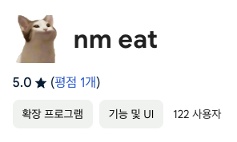
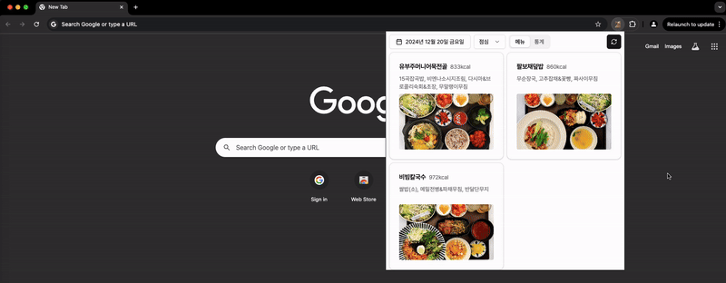
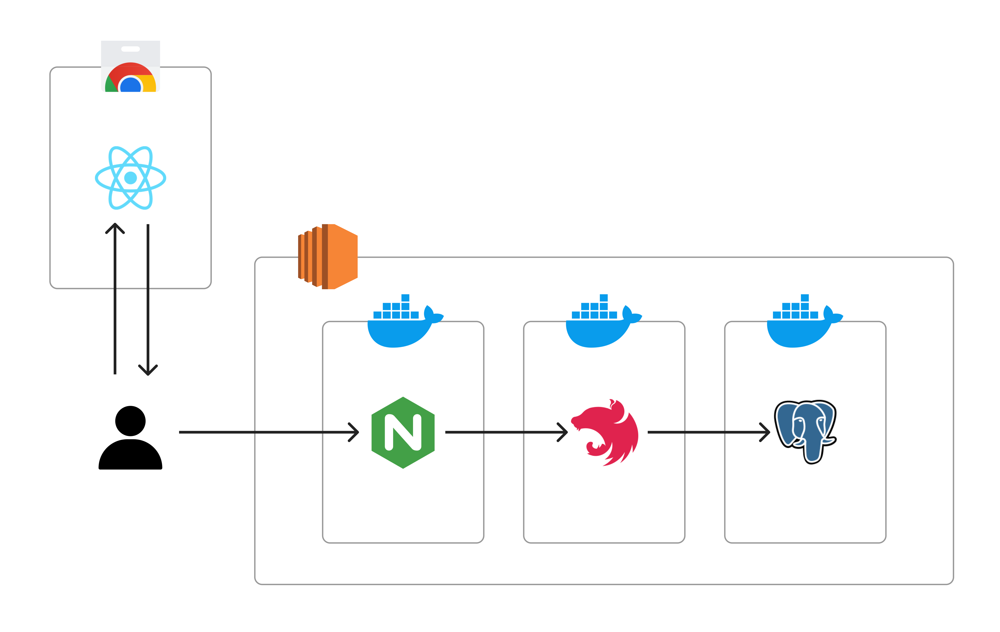

# nhn-eat

 

메뉴 확인 및 **투표 집계 결과 기능**이 있는 NHN 구내식당 메뉴 크롬 익스텐션, 근데 **고양이**를 곁들인.

[다운로드](https://chromewebstore.google.com/detail/nm-eat/aelgjngikkoofmdjlgnhheafhjnnbjje?hl=ko)

# 개요

- 문제점

  - 구내식당 메뉴를 확인하기 위해서는 휴대폰을 사용해야하기 때문에 손의 동선 낭비가 발생된다.
  - 막상 내려가보면 희망한 메뉴의 줄이 너무 길어 망설이는 시간이 생긴다.

- 해결

  - 크롬 익스텐션을 사용하여 업무 중에도 쉽게 메뉴를 확인할 수 있게 한다.
  - 메뉴를 확인함과 동시에 고를 수 있는 기능을 추가하여 메뉴들의 선호도를 한눈에 볼 수 있게 한다.

# 기술

#### 프론트

 

#### 백엔드

 

#### 인프라

# 인원

| 기획   | 프론트 | 백엔드 |
| ------ | ------ | ------ |
| 이상철 | 이상철 | 이상철 |

# 프로젝트 구조

# 테이블

